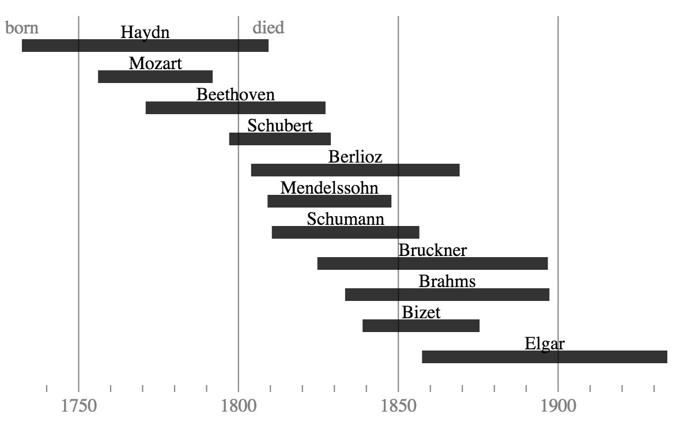

#Joseph Priestley timeline

This sample uses the data visualisation library d3.js to create a timeline of dates and durations similar to those popularised by [Jospeh Priestley](https://en.wikipedia.org/wiki/Joseph_Priestley) in the 18th century.

It takes as its input the datafile [composers.csv](composers.csv) which simply contains the name of a composer, along with birth and death date.

For more information, please visit the [FT Chart Doctor](http://www.ft.com/chart-doctor)
