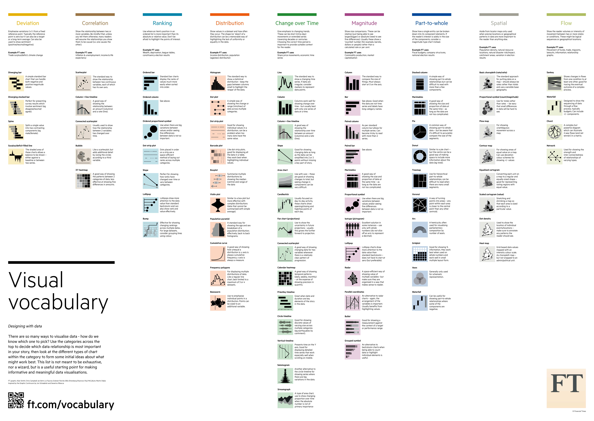

# Financial Times Visual Vocabulary

A poster (available in [English](https://github.com/ft-interactive/chart-doctor/blob/master/visual-vocabulary/Visual-vocabulary.pdf), [Japanese](https://github.com/ft-interactive/chart-doctor/blob/master/visual-vocabulary/Visual-vocabulary-JP.pdf), [traditional Chinese](https://github.com/ft-interactive/chart-doctor/blob/master/visual-vocabulary/Visual-vocabulary-chinese-traditional.pdf) and [simplified Chinese](https://github.com/ft-interactive/chart-doctor/blob/master/visual-vocabulary/Visual-vocabulary-chinese-simplified.pdf)) and [web site](http://ft-interactive.github.io/visual-vocabulary/) to assist designers and journalists to select the optimal symbology for data visualisations, by the [Financial Times Visual Journalism Team](https://www.ft.com/visual-journalism).

The FT Visual Vocabulary is at the core of a newsroom-wide training session aimed at improving chart literacy. This learning resource is inspired by the [Graphic Continuum](https://policyviz.com/2014/09/09/graphic-continuum/) by Jon Schwabish and Severino Ribecca. This is not an attempt to teach everyone how to make charts, but how to recognise the opportunities to use them effectively alongside words.

Read the [Chart Doctor](http://www.ft.com/chart-doctor) feature column for full background on why we made this: [Simple techniques for bridging the graphics language gap](https://www.ft.com/content/304419ec-63a3-11e6-8310-ecf0bddad227)

For D3 templates for producing many of these chart types in FT style, see our [Visual Vocabulary repo](https://github.com/ft-interactive/visual-vocabulary).

- - -

## Related reading

The full content of the poster, along with links to related material, including research and examples of best practice. _This is a work in progress._

### General

* National Geographic: [Taking data visualisation from eye candy to efficiency](http://news.nationalgeographic.com/2015/09/150922-data-points-visualization-eye-candy-efficiency/)
* William S. Cleveland and Robert McGill: [Graphical Perception: Theory, Experimentation, and Application to the Development of Graphical Methods](http://info.slis.indiana.edu/~katy/S637-S11/cleveland84.pdf)
* Hadley Wickham: [A Layered Grammar of Graphics](http://vita.had.co.nz/papers/layered-grammar.pdf)
* Tracey L. Weissgerber et al: [Beyond Bar and Line Graphs: Time for a New Data Presentation Paradigm](http://journals.plos.org/plosbiology/article?id=10.1371/journal.pbio.1002128)
* Numeroteca: [Uses and abuses of data visualisations in mass media](http://numeroteca.org/2016/05/18/uses-and-abuses-of-data-visualizations-in-mass-media/)
* Andy Cotgreave: [The inevitability of data visualization criticism](http://www.computerworld.com/article/3048315/data-analytics/the-inevitability-of-data-visualization-criticism.html)
* Alberto Cairo: ["Our reader" won't understand something as complicated as that!](http://www.thefunctionalart.com/2016/05/our-reader-wont-understand-something-as.html)
* Alberto Cairo: [Visualization's expanding vocabulary](http://www.thefunctionalart.com/2016/05/visualizations-expanding-vocabulary.html)

### Deviation

Emphasise variations (+/-) from a fixed reference point. Typically the reference point is zero but it can also be a target or a long-term average. Can also be used to show sentiment (positive/neutral/negative). *Example FT uses:* Trade surplus/deficit, climate change

#### Diverging bar

A simple standard bar chart that can handle both negative and positive magnitude values.

* Chart Doctor: [How the FT explained Brexit](https://www.ft.com/content/3bfc0aac-4ccd-11e6-88c5-db83e98a590a)

#### Diverging stacked bar

Perfect for presenting survey results which involve sentiment (eg disagree/neutral/agree).

#### Spine chart

Splits a single value into 2 contrasting components (eg Male/Female)

#### Surplus/deficit filled line

The shaded area of these charts allows a balance to be shown – either against a baseline or between two series.

### Correlation

Show the relationship between two or more variables. Be mindful that, unless you tell them otherwise, many readers will assume the relationships you show them to be causal (i.e. one causes the other). *Example FT uses:* Inflation & unemployment, income & life expectancy

* Chart Doctor: [The German election and the trouble with correlation](https://www.ft.com/content/94e3acec-a767-11e7-ab55-27219df83c97)

#### Scatterplot

The standard way to show the relationship between two continuous variables, each of which has its own axis.

* Chart Doctor: [The storytelling genius of unveiling truths through charts](https://www.ft.com/content/e2eba288-ef83-11e6-930f-061b01e23655)
* Maarten Lambrechts: [7 reasons you should use dot graphs](http://www.maartenlambrechts.com/2015/05/03/to-the-point-7-reasons-you-should-use-dot-graphs.html)
* Tim Brock: [Too Big Data: Coping with Overplotting](https://www.infragistics.com/community/blogs/tim_brock/archive/2015/04/21/too-big-data-coping-with-overplotting.aspx)
* Sara Kehaulani Goo: [The art and science of the scatterplot](http://www.pewresearch.org/fact-tank/2015/09/16/the-art-and-science-of-the-scatterplot/)
* Chart Doctor: [The storytelling genius of unveiling truths through charts](https://www.ft.com/content/e2eba288-ef83-11e6-930f-061b01e23655)
* *Examples:* [_FT_](https://www.ft.com/content/1ce1a720-ce94-3c32-a689-8d2356388a1f)

#### Line + Column

A good way of showing the relationship between an amount (columns) and a rate (line)

* Data Revelations: [Be Careful with Dual Axis Charts](http://www.datarevelations.com/be-careful-with-dual-axis-charts.html)
* DataHero: [The Do’s and Don’ts of Dual Axis Charts](https://datahero.com/blog/2015/04/23/the-dos-and-donts-of-dual-axis-charts/)
* Harvard Business Review: [Beware Spurious Correlations](https://hbr.org/2015/06/beware-spurious-correlations)

#### Connected scatterplot

Usually used to show how the relationship between two variables has changed over time.

* Robert Kosara: [The Connected Scatterplot for Presenting Paired Time Series](https://eagereyes.org/papers/the-connected-scatterplot-for-presenting-paired-time-series)
* Data Revelations: [Be Careful with Dual Axis Charts](http://www.datarevelations.com/be-careful-with-dual-axis-charts.html)
* *Examples:* [_Washington Post_](https://www.washingtonpost.com/apps/g/page/business/the-end-of-the-us-oil-boom-told-through-one-texas-companys-bust/1999/)

#### Bubble

Like a scatterplot, but adds additional detail by sizing the circles according to a third variable 

* Chart Doctor: [The storytelling genius of unveiling truths through charts](https://www.ft.com/content/e2eba288-ef83-11e6-930f-061b01e23655)
* *Examples:* [_FT_](https://ig.ft.com/managements-missing-women-data/)

#### XY heatmap

A good way of showing the patterns between 2 categories of data, less good at showing fine differences in amounts.

* Chart Doctor: [Use fewer maps to illustrate data better](https://www.ft.com/content/de3ef722-9514-11e6-a1dc-bdf38d484582)

### Ranking

Use where an item’s position in an ordered list is more important than its absolute or relative value. Don’t be afraid to highlight the points of interest. *Example FT uses:* Wealth, deprivation, league tables, constituency election results

#### Ordered bar

Standard bar charts display the ranks of values much more easily when sorted into order

#### Ordered column

See above.

#### Ordered proportional symbol

Use when there are big variations between values and/or seeing fine differences between data is not so important.

#### Dot strip plot

Dots placed in order on a strip are a space-efficient method of laying out ranks across multiple categories.

#### Slope

Perfect for showing how ranks have changed over time or vary between categories. 

#### Lollipop chart

Lollipops draw more attention to the data value than standard bar/column and can also show rank and value effectively.

### Distribution

Show values in a dataset and how often they occur. The shape (or ‘skew’) of a distribution can be a memorable way of highlighting the lack of uniformity or equality in the data. *Example FT uses:* Income distribution, population (age/sex) distribution

* Joey Cherdarchuk: [Visualising distributions](http://www.darkhorseanalytics.com/blog/visualizing-distributions-3)

#### Histogram

The standard way to show a statistical distribution - keep the gaps between columns small to highlight the ‘shape’ of the data

* Aran Lunzer and Amelia McNamara: [Exploring histograms](http://tinlizzie.org/histograms/)

#### Boxplot

Summarise multiple distributions by showing the median (centre) and range of the data

#### Violin plot

Similar to a box plot but more effective with complex distributions (data that cannot be summarised with simple average).

#### Population pyramid

A standard way for showing the age and sex breakdown of a population distribution; effectively, back to back histograms.

#### Dot strip plot

Good for showing individual values in a distribution, can be a problem when too many dots have the same value.

#### Dot plot

A simple way of showing the change or range (min/max) of data across multiple categories. 

#### Barcode plot

Like dot strip plots, good for displaying all the data in a table,they work best when highlighting individual values.

* Maarten Lambrechts: [Interactive strip plots for visualizing demographics](http://www.maartenlambrechts.com/2015/11/30/interactive-strip-plots-for-visualizing-demographics.html)

#### Cumulative curve

A good way of showing how unequal a distribution is: y axis is always cumulative frequency, x axis is always a measure.

### Change over Time

Give emphasis to changing trends. These can be short (intra-day) movements or extended series traversing decades or centuries. Choosing the correct time period is important to provide suitable context for the reader. *Example FT uses:* Share price movements, economic time series

* Flowing Data: [11 Ways to Visualize Changes Over Time – A Guide](http://flowingdata.com/2010/01/07/11-ways-to-visualize-changes-over-time-a-guide/)

#### Line 

The standard way to show a changing time series. If data are irregular, consider markers to represent data points 

* Chart Doctor: [A chart’s ability to mislead is off the scale](https://www.ft.com/content/3062d082-e3da-11e6-8405-9e5580d6e5fb)
* Office for National Statistics: [Does the axis have to start at zero? (Part 1 – line charts)](https://blog.ons.digital/2016/06/27/does-the-axis-have-to-start-at-zero-part-1-line-charts/)
* Quartz: [It's OK not to start your y-axis at zero](https://qz.com/418083/its-ok-not-to-start-your-y-axis-at-zero/)
* Vox: [Shut up about the y-axis. It should't always start at zero](https://www.youtube.com/watch?v=14VYnFhBKcY)
* Emily Schuch: [How to Make a Line Chart that Doesn't Lie](http://emschuch.github.io/Planned-Parenthood/)

#### Column 

Columns work well for showing change over time - but usually best with only one series of data at a time.

* Chart Doctor: [A chart’s ability to mislead is off the scale](https://www.ft.com/content/3062d082-e3da-11e6-8405-9e5580d6e5fb)
* Office for National Statistics: [Does the axis have to start at zero? (Part 2 – bar charts)](https://blog.ons.digital/2016/07/19/does-the-axis-have-to-start-at-zero-part-2-bar-charts/)

#### Line + column 

A good way of showing the relationship over time between an amount (columns) and a rate (line)

#### Stock price 

Usually focused on day-to-day activity, these charts show opening/closing and hi/low points of each day 

#### Slope 

Good for showing changing data as long as the data can be simplified into 2 or 3 points without missing a key part of story 

#### Area chart 

Use with care – these are good at showing changes to total, but seeing change in components can be very difficult 

#### Fan chart (projection) 

Use to show the uncertainty in future projections - usually this grows the further forward to projection 

#### Connected scatterplot 

A good way of showing changing data for two variables whenever there is a relatively clear pattern of progression. 

#### Calendar heatmap 

A great way of showing temporal patterns (daily, weekly, monthly) – at the expense of showing precision in quantity. 

#### Priestley timeline 

Great when date and duration are key elements of the story in the data.

* Chart Doctor: [Communicating with data: Timelines](https://www.ft.com/content/6f777c84-322b-11e6-ad39-3fee5ffe5b5b)
* *Examples:* [_FT_](https://www.ft.com/content/e7591532-9338-11e6-a1dc-bdf38d484582)

#### Circle timeline 

Good for showing discrete values of varying size across multiple categories (eg earthquakes by contintent). 

#### Seismogram 

Another alternative to the circle timeline for showing series where there are big variations in the data.

### Part-to-whole

Show how a single entity can bebroken down into its component elements. If the reader’s interest issolely in the size of the components,consider a magnitude-type chartinstead. *Example FT uses:* Fiscal budgets, company structures,national election results

* Flowing Data: [9 Ways to Visualize Proportions – A Guide](http://flowingdata.com/2009/11/25/9-ways-to-visualize-proportions-a-guide/)

#### Stacked column

A simple way of showing part-to-whole relationships but can be difficult to read with more than a few components.

* Robert Kosara: [Stacked bars are the worst](https://eagereyes.org/techniques/stacked-bars-are-the-worst)

#### Proportional stacked bar

A good way of showing the size and proportion of data at the same time – as long as the data are not too complicated. 

* Chart Doctor: [How to apply Marimekko to data](https://www.ft.com/content/3ee98782-9149-11e7-a9e6-11d2f0ebb7f0)

#### Pie

A common way of showing part-to-whole data – but be aware that it’s difficult to accurately compare the size of the segments.

* Robert Kosara: [Ye olde pie chart debate](https://eagereyes.org/blog/2015/ye-olde-pie-chart-debate)
* Robert Kosara: [Pie Charts – Unloved, Unstudied, and Misunderstood](https://eagereyes.org/talk/pie-charts-unloved-unstudied-and-misunderstood)
* Robert Kosara: [An Illustrated Tour of the Pie Chart Study Results](https://eagereyes.org/blog/2016/an-illustrated-tour-of-the-pie-chart-study-results)
* David Robinson: [How to replace a pie chart](http://varianceexplained.org/r/improving-pie-chart/)
* Office for National Statistics: [The humble pie chart: part 1](https://blog.ons.digital/2017/01/24/the-humble-pie-chart-part1/)
* Office for National Statistics: [The humble pie chart: part 2](https://blog.ons.digital/2017/02/23/the-humble-pie-chart-part2/)
* Ian Spence: [No humble pie: The origins and usage of a statistical chart](http://www.psych.utoronto.ca/users/spence/Spence%202005.pdf)
* Jeff Clark: [In defense of pie charts](http://www.neoformix.com/2007/InDefenseOfPieCharts.html)
* Stephen Few: [Save the Pies for Dessert](https://www.perceptualedge.com/articles/visual_business_intelligence/save_the_pies_for_dessert.pdf)

#### Donut

Similar to a pie chart – but the centre can be a good way of making space to include more information about the data (eg. total) 

#### Treemap

Use for hierarchical part-to-whole relationships; can be difficult to read when there are many small segments.

#### Voronoi

A way of turning points into areas – any point within each area is closer to the central point than any other centroid.

#### Arc

A hemicycle, often used for visualising political results in parliaments.

#### Gridplot

Good for showing % information, they work best when used on whole numbers and work well in multiple layout form.

#### Venn

Generally only used for schematic representation

#### Waterfall

Can be useful for showing part-to-whole relationships where some of the components are negative.

### Magnitude

Show size comparisons. These can berelative (just being able to seelarger/bigger) or absolute (need tosee fine differences). Usually theseshow a ‘counted’ number (for example, barrels, dollars or people) rather thana calculated rate or per cent. *Example FT uses:* Commodity production, marketcapitalisation

#### Column

The standard way to compare the size of things. Must always start at 0 on the axis

#### Bar

See above. Good when the data are not time series and labels have long category names.

#### Paired column

As per standard column but allows for multiple series. Can become tricky to read with more than 2 series.

#### Paired bar

See above.

#### Proportional stacked bar

A good way of showing the size and proportion of data at the same time – as long as the data are not too complicated.

* Chart Doctor: [How to apply Marimekko to data](https://www.ft.com/content/3ee98782-9149-11e7-a9e6-11d2f0ebb7f0)

#### Proportional symbol

Use when there are big variations between values and/or seeing fine differences between data is not so important.

#### Isotype (pictogram)

Excellent solution in some instances – use only with whole numbers (do not slice off an arm to represent a decimal).

#### Lollipop chart

Lollipop charts draw more attention to the data value than standard bar/column – does not HAVE to start at zero (but preferable).

#### Radar chart

A space-efficient way of showing value pf multiple variables– but make sure they are organised in a way that makes sense to reader.

#### Parallel coordinates

An alternative to radar charts – again, the arrngement of the variables is important. Usually benefits from highlighting values.

### Spatial

Used only when precise locations orgeographical patterns in data aremore important to the reader thananything else. *Example FT uses:* Locator maps, population density,natural resource locations, naturaldisaster risk/impact, catchment areas, variation in election results

* Chart Doctor: [Use fewer maps to illustrate data better](https://www.ft.com/content/de3ef722-9514-11e6-a1dc-bdf38d484582)
* Matthew Ericson: [When Maps Shouldn’t Be Maps](http://www.ericson.net/content/2011/10/when-maps-shouldnt-be-maps/)
* Mapbox: [7 data visualization techniques for location](https://blog.mapbox.com/7-data-visualizations-techniques-for-location-544c558cc960)

#### Basic choropleth (rate/ratio)

The standard approach for putting data on a map – should always be rates rather than totals and use a sensible base geography

* Vox: [The bad map we see every presidential election](http://www.vox.com/2016/5/17/11686328/bad-election-map)
* Vox: [This “bad” election map? It’s not so bad.](http://www.vox.com/2016/6/2/11828628/election-maps-hard)
* UX•Blog: [Telling the truth](http://uxblog.idvsolutions.com/2011/10/telling-truth.html)

#### Proportional symbol (count/magnitde)

Use for totals rather than rates – be wary that small differences in data will be hard to see.

* Stephen Few: [What Can’t Be Built with Bricks?](https://www.perceptualedge.com/blog/?p=1627)

#### Flow map

For showing unambiguous movement across a map.

#### Contour map

For showing areas of equal value on a map. Can use deviation colour schemes for showing +/- values

#### Equalised cartogram

Converting each unit on a map to a regular and equally-sized shape – good for representing voting regions with equal value.

* Chart Doctor: [How the FT explained Brexit](https://www.ft.com/content/3bfc0aac-4ccd-11e6-88c5-db83e98a590a)
* 5W Blog: [The power of cartograms and creating them easily](https://5wvelascoblog.com/2016/10/27/the-power-of-cartograms-and-creating-them-easily/)

#### Scaled cartogram (value)

Stretching and shrinking a map so that each area is sized according to a particular value.

* Chart Doctor: [The search for a better US election map](https://www.ft.com/content/3685bf9e-a4cc-11e6-8b69-02899e8bd9d1)
* 5W Blog: [The power of cartograms and creating them easily](https://5wvelascoblog.com/2016/10/27/the-power-of-cartograms-and-creating-them-easily/)
* Vox: [The bad map we see every presidential election](https://www.youtube.com/watch?v=hlQE4IGFc5A)

#### Dot density

Used to show the location of individual events/locations – make sure to annotate any patterns the reader should see.

* Chart Doctor: [The search for a better US election map](https://www.ft.com/content/3685bf9e-a4cc-11e6-8b69-02899e8bd9d1)

#### Heat map

Grid-based data values mapped with an intensity colour scale. As choropleth map – but not snapped to an admin/political unit.

* 5W Blog: [The power of cartograms and creating them easily](https://5wvelascoblog.com/2016/10/27/the-power-of-cartograms-and-creating-them-easily/)

### Flow

Show the reader volumes or intensity of movement between two or more states or conditions. These might belogical sequences or geographical locations. *Example FT uses:* Movement of funds, trade, migrants, lawsuits, information; relationship graphs.

* RJ Andrews: [Picturing the Great Migration](https://medium.com/info-we-trust/picturing-the-great-migration-9e4b5a3eca8a)

#### Sankey (aka river plot)

Shows changes in flows from one condition to at least one other; good for tracing the eventual outcome of a complex process. 

* Chart Doctor: [Data visualisation: it is not all about technology](https://www.ft.com/content/aba6c58e-5a8e-11e7-9bc8-8055f264aa8b)

#### Waterfall

Designed to show the sequencing of data through a flow process, typically budgets. Can include +/- components.

#### Chord

A complex but powerful diagram which can illustrate 2-way flows (and net winner) in a matrix.

#### Network

Used for showing the strength and inter-connectedness of relationships of varying types. 

- - - 

Todo:

### Uncertainty

* Scientific American: [Visualising uncertain weather](https://blogs.scientificamerican.com/sa-visual/visualizing-uncertain-weather/)
* Oli Hawkins: [Animating uncertainty](http://olihawkins.com/2013/09/2)

### Animation

* Chart Doctor: [The storytelling genius of unveiling truths through charts](https://www.ft.com/content/e2eba288-ef83-11e6-930f-061b01e23655)
* Evan Sinar: [Use Animation to Supercharge Data Visualization](https://medium.com/@EvanSinar/use-animation-to-supercharge-data-visualization-cd905a882ad4)

### Interactivity

* Chart Doctor: [Why the FT creates so few clickable graphics](https://www.ft.com/content/c62b21c6-7feb-11e6-8e50-8ec15fb462f4)
* Gregor Aisch: [In defense of interactive graphics](https://www.vis4.net/blog/posts/in-defense-of-interactive-graphics/)
* Zan Armstrong: [Why choose? Scrollytelling and steppers](https://medium.com/@zanarmstrong/why-choose-scrollytelling-steppers-155a59dd97fe))

### Map projections

### Colour

- - - 

## Licence

Copyright &copy; The Financial Times Limited, all rights reserved. For more information about re-publishing FT content, please contact our [syndication department](http://syndication.ft.com/).
